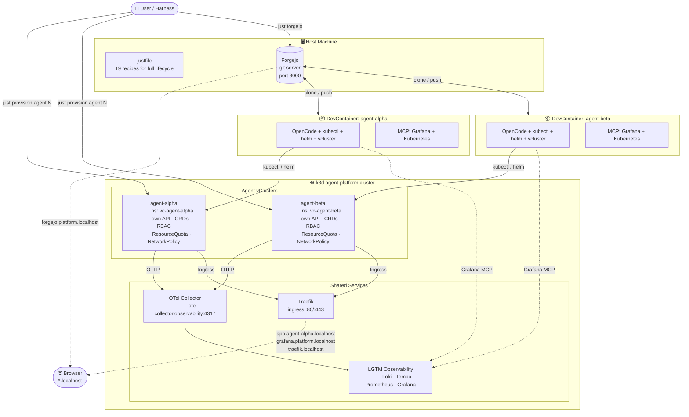
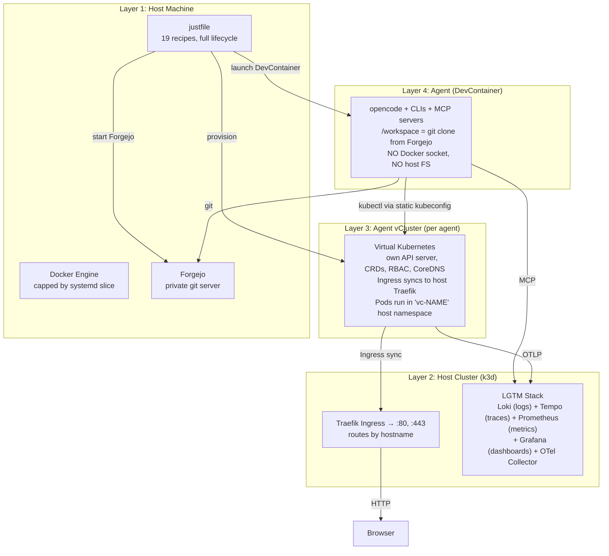
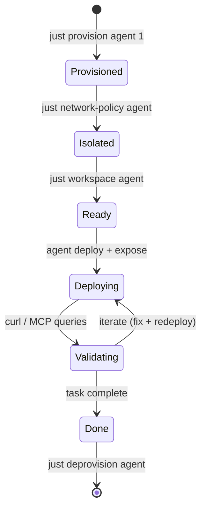
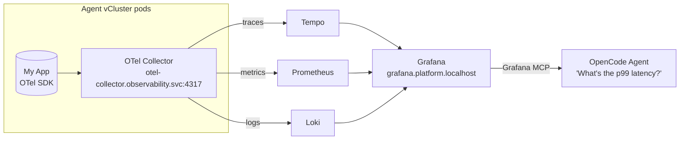
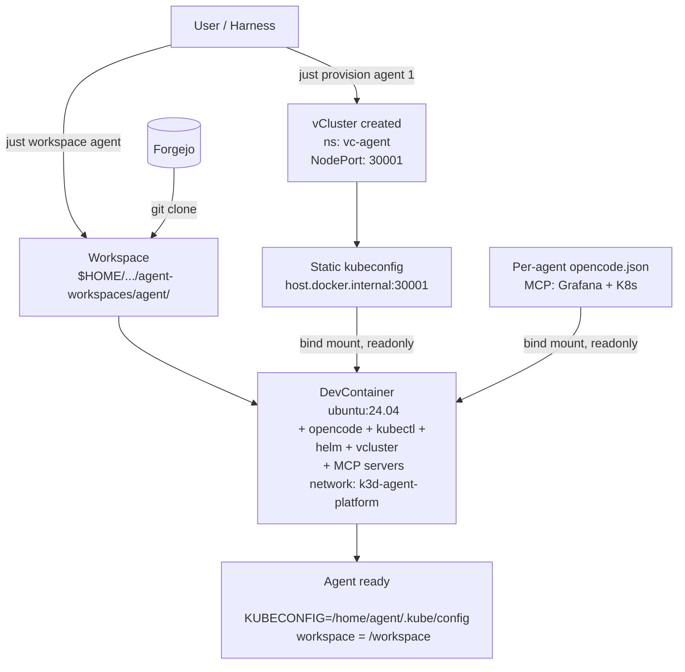

# Architecture & Use-Case

## What problem does this solve?

An LLM coding agent needs a **real Kubernetes cluster** to validate its work — not
mocks, not `docker-compose`, not guessing. It needs to deploy, expose, observe, and
iterate. Doing this on your laptop should be **safe, cheap, and zero-config**.

This platform gives each agent its own **ephemeral, isolated vCluster** with a shared
observability stack, a local Git server for code, and MCP servers for introspection.
One `just` command provisions an agent. One `just` command tears it down.


```

## Architecture Layers



## Agent Lifecycle



## Data Flow: Observability



## Configuration Flow



## Key Design Principles

| Principle | Implementation |
|---|---|
| **Zero blast radius** | Agents have their own vCluster. `kubectl delete all` only affects their namespace. Teardown is instant. |
| **Real Kubernetes** | vClusters have their own API server, CRDs, RBAC, CoreDNS. Not a mock. |
| **Shared observability** | One LGTM stack + OTel Collector serves all agents. Telemetry tagged by vCluster namespace. |
| **Cheap iteration** | Agents are cheap LLM models (~$0.01/1M tokens). They can explore, fail, and retry without financial risk. |
| **No Docker socket** | Agents can deploy and expose but can't create containers or access the host. |
| **Local-first** | Everything runs on one machine. No cloud dependencies. No external Git hosting. |
| **Justfile as interface** | User never touches `kubectl` or `helm` directly. `just provision` / `just deprovision` / `just nuke`. |
| **Agent orientation via skill** | `.opencode/skills/agentic-k8s-platform.md` gives agents instant context about the platform. |
