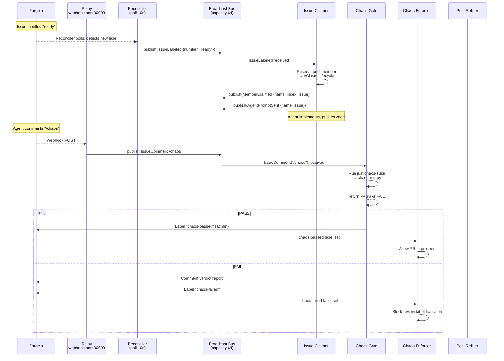

# Event System

The pool-manager communicates internally through a typed broadcast event bus.
Type safety at the `IssueNumber` / `PrNumber` level prevents an entire class of
bugs at compile time.

## Newtype Identifiers

`IssueNumber(u64)` and `PrNumber(u64)` are distinct newtypes (defined in
`crates/pool-manager/src/event.rs`). They are `#[serde(transparent)]` for
serialization but the Rust compiler rejects passing one where the other is
expected. No runtime confusion between issues and pull requests is possible.

```rust
pub struct IssueNumber(pub u64);  // cannot be used as a PrNumber
pub struct PrNumber(pub u64);     // cannot be used as an IssueNumber
```

## Event Enum — 18 Variants in 4 Categories

### Forgejo Events (10 variants)

| Variant | Fields | Trigger |
|---|---|---|
| `IssueOpened` | `number: IssueNumber, title: String` | A new issue is created |
| `IssueLabeled` | `number: IssueNumber, label: String` | A label is added to an issue |
| `IssueUnlabeled` | `number: IssueNumber, label: String` | A label is removed from an issue |
| `IssueClosed` | `number: IssueNumber` | An issue is closed |
| `IssueComment` | `issue_number: IssueNumber, comment_id: u64, user: String, body: String` | A comment is posted on an issue |
| `PrComment` | `pr_number: PrNumber, comment_id: u64, user: String, body: String` | A comment is posted on a pull request |
| `PullRequestOpened` | `pr_number: PrNumber, title: String, head_branch: String` | A new PR is created |
| `PullRequestReview` | `pr_number: PrNumber, state: String, body: String` | A review is submitted on a PR |
| `PullRequestSynchronized` | `pr_number: PrNumber` | New commits pushed to an open PR's head branch. Clears `chaos-passed` — the agent cannot slip untested code into a reviewed PR. |
| `PullRequestMerged` | `pr_number: PrNumber` | A PR is merged |

### vCluster Lifecycle Events (4 variants)

| Variant | Fields | Trigger |
|---|---|---|
| `MemberProvisioned` | `name: String, index: u32` | vCluster created, not yet ready |
| `MemberReady` | `name: String, index: u32` | vCluster ready (API server responding, replicated Service present) |
| `MemberDestroyed` | `name: String` | vCluster deleted |
| `MemberClaimed` | `name: String, index: u32, issue: IssueNumber` | A pool member is bound to a specific issue |

### Agent Communication Events (1 variant)

| Variant | Fields | Trigger |
|---|---|---|
| `AgentPromptSent` | `name: String, issue: IssueNumber` | The pool-manager has sent the initial prompt to an agent |

### Internal / Reconciliation Events (3 variants)

| Variant | Fields | Trigger |
|---|---|---|
| `PoolNeedsRefill` | `current: usize, target: usize` | Pool size drops below `minAvailable` |
| `ReconciliationTick` | *(none)* | Every poll interval (10s) — the reconciler's periodic clock pulse |
| `Shutdown` | *(none)* | `ctrl-c` received, graceful teardown initiated |

## The Bus

```rust
pub struct Bus {
    tx: broadcast::Sender<Event>,
}
```

Wraps `tokio::sync::broadcast::Sender` with capacity 64. Fan-out pub/sub:
every listener gets a copy of every event. `Bus::new(64)` creates the channel;
`Bus::subscribe()` returns a `broadcast::Receiver<Event>`; `Bus::publish(event)`
sends to all subscribers.

Slow consumers are naturally handled by the broadcast channel's bounded buffer
— if a listener falls behind, the oldest events are dropped (lagged receivers
get a `Lagged` error on their next `recv`).

## Event Flow



## Event Sources

**Relay** (`crates/pool-manager/src/relay.rs`): an HTTP server on `:30990` that
receives Forgejo webhooks. Parses the webhook payload and publishes the
corresponding `Event` variant. Handles real-time events: issue comments, PR
opens, label changes, pushes.

**Reconciler** (`crates/pool-manager/src/listeners/reconciler.rs`): polls
Forgejo at `pollInterval` seconds (configurable, default 10s in
`scripts/pool-config.json`). Emits `ReconciliationTick` on every poll and
derives state-change events by comparing current Forgejo state against
the in-memory `PoolState`. This catches events the webhook might miss
(network blips, Forgejo restart, initial state).

## Event Consumers — 10 Listeners

All spawned by `listeners::spawn_all()` in `crates/pool-manager/src/listeners/mod.rs`:

| Listener | Subscribes | Purpose |
|---|---|---|
| `reconciler` | *(produces events)* | Polls Forgejo, emits `ReconciliationTick` and state-change events |
| `pool_refiller` | `PoolNeedsRefill`, `MemberDestroyed` | Maintains `minAvailable` warm pool members |
| `issue_claimer` | `IssueLabeled("ready")` | Claims an idle pool member for a ready-labelled issue |
| `closed_reaper` | `IssueClosed` | Releases the member back to the pool when the issue closes |
| `comment_router` | `IssueComment` | Routes issue comments to appropriate handlers |
| `pr_comment_router` | `PrComment` | Routes PR comments to appropriate handlers |
| `pr_monitor` | `PullRequestOpened`, `PullRequestSynchronized` | Tracks PR state, invalidates stale chaos passes |
| `health_monitor` | *(tick-driven)* | Periodic health checks on claimed agents |
| `chaos_gate` | `IssueComment("/chaos")` | Runs the chaos suite when an agent requests it |
| `chaos_enforcer` | `IssueLabeled`, `PullRequestOpened` | Blocks unreviewable PRs — enforces that `chaos-passed` must be present before a PR can carry the `review` label |
