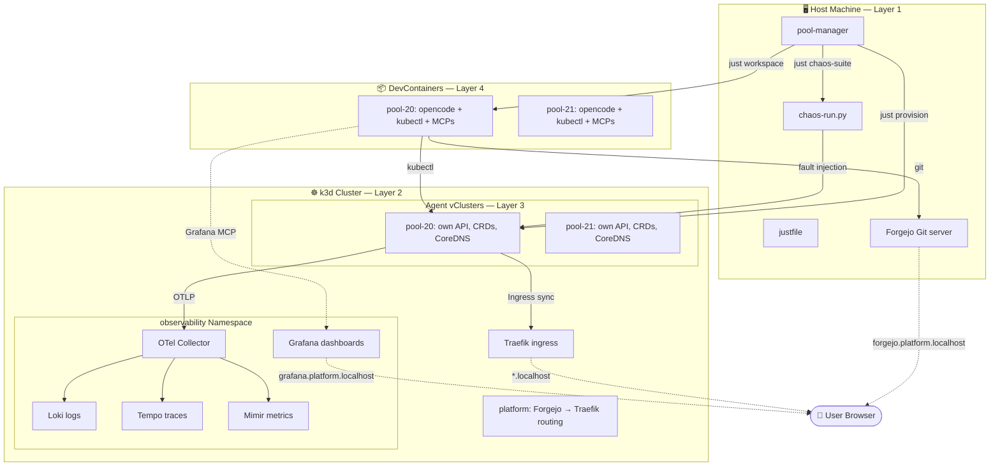
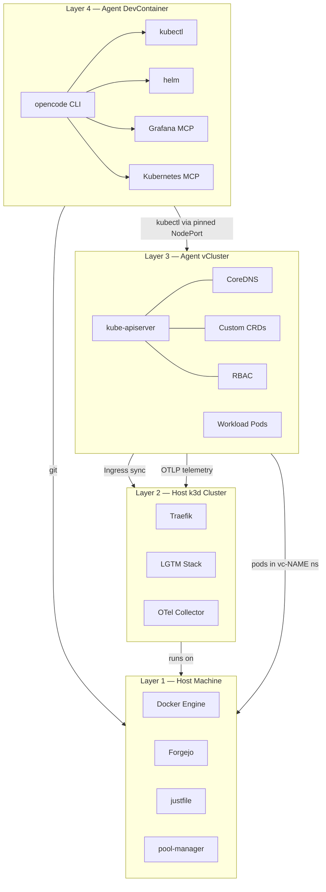
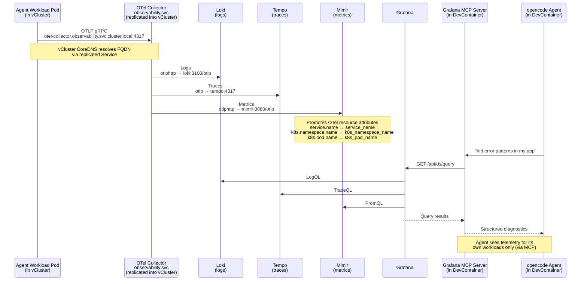

# Architecture Overview

The Agentic Kubernetes Platform is a four-layer stack that gives AI coding agents
isolated Kubernetes clusters, a shared observability pipeline, and a mandatory
chaos-testing gate before any work goes to review.

## Four-Layer Architecture

### Layer 4 — Agent DevContainer

The agent's execution sandbox. A DevContainer with:

- **opencode** CLI (the agent harness)
- **kubectl** (scoped to its vCluster via static kubeconfig)
- **helm** (for deploying workloads)
- **MCP servers**: Grafana (query telemetry) + Kubernetes (cluster ops)
- **No Docker socket** — agents push code to Forgejo, not images

The DevContainer is built per-agent by `just workspace`. Ports are deterministic:
OpenChamber UI at `31000 + index`, opencode API at `32000 + index`. The kubeconfig
is static (CA embedded, no live proxy) and targets `host.docker.internal` at the
agent's pinned NodePort.

### Layer 3 — Agent vCluster

Each agent gets a full virtual Kubernetes cluster, provisioned by
`vcluster create --driver helm`. Inside the vCluster the agent has:

- **Own API server** — real kube-apiserver, not a mock
- **Own CRDs** — agents can install conflicting CRDs across vClusters without cross-contamination
- **Own RBAC** — the agent is effectively cluster-admin inside its vCluster
- **Own CoreDNS** — forwards unknown `svc.cluster.local` queries to host DNS
- **Workload isolation** — pods run in the host namespace `vc-<name>`, opaque to other agents

The vCluster syncs Ingress resources up to the host Traefik so that
`<app>.<agent-name>.localhost` routes correctly with no port-forwarding.
The OTel Collector service is replicated from host `observability` namespace into
each vCluster's `observability` namespace so that
`otel-collector.observability.svc.cluster.local` resolves natively
(via `networking.replicateServices.fromHost` in `values/vcluster.yaml`).

**Agent budget** (enforced by ResourceQuota + LimitRange per namespace):

| Resource | Limit |
|---|---|
| `requests.cpu` | 4 |
| `requests.memory` | 8Gi |
| `limits.memory` | 24Gi |
| Pods | 50 |
| PVCs | 10 |

There is no CPU limit ceiling — only CPU requests are quota'd, so containers
never hit CFS throttling. Default memory limit for containers without explicit
limits (including initContainers and sidecars) is 512Mi.

### Layer 2 — Host Cluster (k3d)

A single k3d cluster named `agent-platform` with 1 server + 2 agents
(4g / 12g memory). Created by `just bootstrap`. Ports published:

- `80` and `443` → loadbalancer (Traefik ingress)
- `30000–30050` → server:0 (pinned NodePorts for vCluster APIs)

Shared services run in the `observability` namespace:

| Service | Chart / Component | Version |
|---|---|---|
| Loki (logs) | `grafana/loki` | 7.1.0 |
| Tempo (traces) | `grafana/tempo` | 1.24.4 |
| Grafana (dashboards) | `grafana/grafana` | 10.5.15 |
| Mimir (metrics) | `charts/observability` | monolithic, one deployment |
| OTel Collector | `charts/observability` | gRPC on NodePort 30417 |

Traefik handles ingress routing by Host header. vCluster Ingress resources
are synced to host Traefik automatically.

### Layer 1 — Host Machine

The bare-metal or VM running everything:

- **Docker Engine** — capped by systemd slice `k3dcap.slice` (`just harden`:
  default 48G memory, 1400% CPU quota, `MemorySwapMax=0`)
- **Forgejo** Git server — Docker container on the `k3d-agent-platform` network,
  HTTP at `forgejo.platform.localhost` (via Traefik), SSH on `localhost:2222`
- **justfile** — ~800 lines of Bash, the full operator interface for lifecycle
  management (bootstrap, provision, workspace, chaos, deprovision, nuke)
- **pool-manager** — Rust binary that maintains a warm pool of vClusters,
  claims them for ready-labelled issues, and coordinates the chaos gate

## Platform Overview

## Vertical Stack View

## Data Flow: Agent → OTel → LGTM → Grafana MCP → Agent

## Hostname Pattern

Two DNS zones coexist, each serving a different purpose:

| Pattern | Purpose | Example |
|---|---|---|
| `*.localhost` | Browser access, Traefik host routing | `app.pool-20.localhost` |
| `*.svc.cluster.local` | Pod-to-pod within cluster (FULL FQDN only) | `otel-collector.observability.svc.cluster.local` |

Browser DNS resolution: `*.localhost` → systemd-resolved wildcard → `127.0.0.1`.
In-cluster, vCluster CoreDNS forwards unknown cluster-local queries to host DNS.
Short names (like `otel-collector`) return NXDOMAIN — the full FQDN is required.
