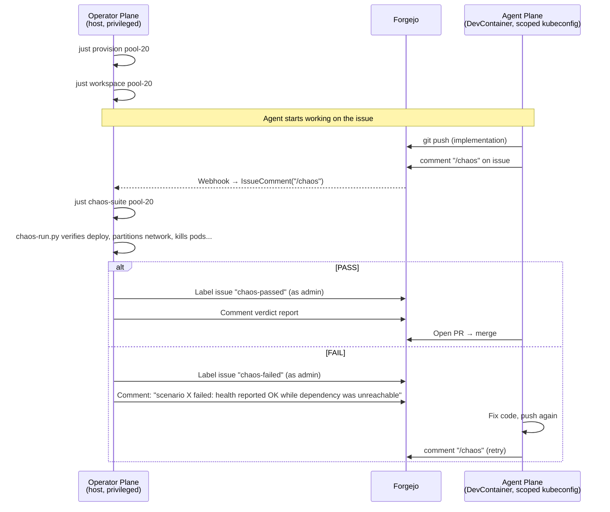

# Two-Plane Security Model

The platform divides all operations into two mutually exclusive planes.
The agent requests; the operator executes. An agent can never judge its own
work, run the chaos suite, or access another agent's vCluster.

## Operator Plane

Runs on the host machine with full privileges. Responsible for:

- **Pool management**: `just provision` creates vClusters; `just deprovision` tears them down
- **Chaos execution**: runs `scripts/chaos-run.py` against an agent's vCluster
- **Verdict posting**: labels issues `chaos-passed` or `chaos-failed` via the Forgejo admin account
- **Agent lifecycle**: creates DevContainers, provisions Forgejo agent users
- **Dashboard sync**: runs `just watch-dashboards` to push agent ConfigMaps into Grafana

The pool-manager Rust binary (at `crates/pool-manager/`) runs on the host.
It listens for Forgejo webhooks on port `:30990` and polls Forgejo every 10 seconds
via the reconciler. It alone holds the Forgejo admin token and the host kubeconfig.

## Agent Plane

Runs inside a DevContainer with a scoped kubeconfig. The agent can:

- **Implement issues**: write code, build manifests, deploy to its vCluster
- **Expose services**: create Ingress resources (`kubectl create ingress --rule=`)
- **Trigger chaos**: comment `/chaos` on its issue (the operator picks this up and runs the suite)
- **Open PRs**: push code to Forgejo, open pull requests for human review
- **Merge**: merge its own PRs once the chaos gate passes

## What the Agent NEVER Holds Privilege To Do

| Operation | Why the agent cannot do it |
|---|---|
| Run the chaos suite (`scripts/chaos-run.py`) | The agent would be grading its own work |
| Post verdict labels (`chaos-passed` / `chaos-failed`) | Admin-only in Forgejo; the pool-manager posts them |
| Create Forgejo agent users | Operator-only; agents log in with pre-provisioned credentials |
| Access other agents' vClusters | NetworkPolicy isolates cross-agent traffic; kubeconfigs are per-agent |
| Deprovision itself | `just deprovision` runs on the host, not inside the DevContainer |

## The Split in Practice

The teardown split mirrors this: when an agent is done, the host-side operator calls
`just deprovision`. The agent has no command to tear itself down.

## Network Isolation

`just network-policy <name>` applies a default-deny Kubernetes NetworkPolicy
to the agent's `vc-<name>` namespace. Works with any CNI (flannel, Cilium, etc.).

**Important warning**: the policy permits egress only to `kube-system`, the agent's
own namespace, and DNS. It does **not** allow the `observability` namespace or the
internet. With the policy enabled, OTLP telemetry from agent workloads stops
reaching the collector. For this reason, network isolation is **off by default**
(`networkPolicy.enabled: false` in `charts/agent/values.yaml`).

The Cilium-only alternative is `just netpol` (writes a `CiliumNetworkPolicy`),
which remains available but requires the experimental Cilium dataplane.
