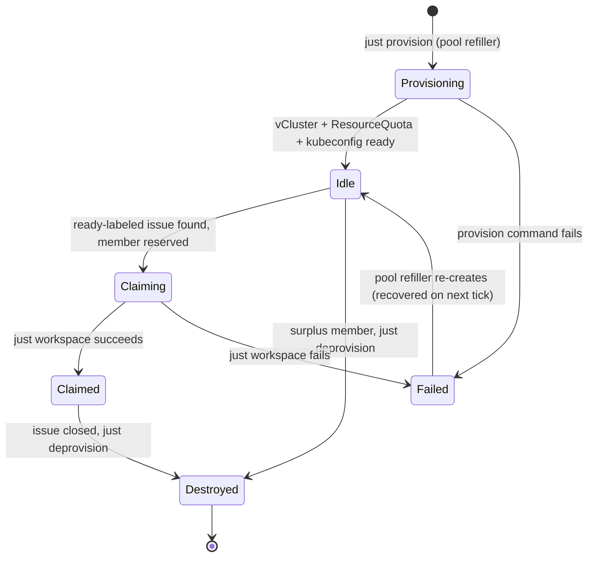

# Agent Lifecycle

The full lifecycle of an agent vCluster member from creation to teardown.

## State Diagram

## States

### 1. Provisioning

The pool refiller creates new vCluster members in advance via `just provision`. This creates:

- An isolated vCluster in namespace `vc-{name}`
- A ResourceQuota (4 CPU requests, 8Gi memory requests, 24Gi memory limits, 50 pods, 10 PVCs)
- A pinned NodePort (30000 + index)
- A static kubeconfig

The member name is `pool-{index}` (e.g. `pool-20`). The NodePort is calculated as `30000 + index`.

### 2. Idle

The member is ready to be claimed. It waits for a Forgejo issue with the `ready` label. The reconciler polls every `pollInterval` seconds for open issues with this label.

### 3. Claiming

A `ready`-labeled issue is found and the member is reserved. The `issue_claimer` listener:

- Guards against double-claim by checking `find_by_issue`
- Sets the member status to `Claiming`
- Calls `reset_for_issue()` which clears all nudge flags, chaos status, and poll watermarks from any previous card

### 4. Claimed

The workspace is ready and the agent is working. The claim process via `just workspace`:

- Clones the repository
- Creates an ephemeral Forgejo agent user (`pool-{index}`) with write access to the repo
- Writes credentials to `/workspace/.forgejo`
- Builds and launches the DevContainer
- The pool manager sends the initial prompt via the opencode API

### 5. Failed

Workspace setup failed. The member goes back to the pool refiller, which re-creates it on the next reconciler tick.

### 6. Destroyed

When an issue is closed, the `closed_reaper` calls `just deprovision`. This tears down:

- The vCluster (`vcluster delete`)
- The namespace (`kubectl delete ns vc-{name}`)
- The DevContainer
- The kubeconfig file
- The opencode configuration

The Forgejo agent user is deleted, and the member is removed from `state.json`.

## Operational Commands

| Command | Purpose |
|---|---|
| `just provision <name> <index>` | Create a new vCluster with all quotas and configuration |
| `just workspace <name> <index> <repo-url>` | Clone repo, build DevContainer, launch workspace |
| `just deprovision <name>` | Tear down a vCluster and all associated resources |
| `just list` | Show all live vClusters |
| `just status` | Show host cluster health (k3d nodes and kubectl node details) |
