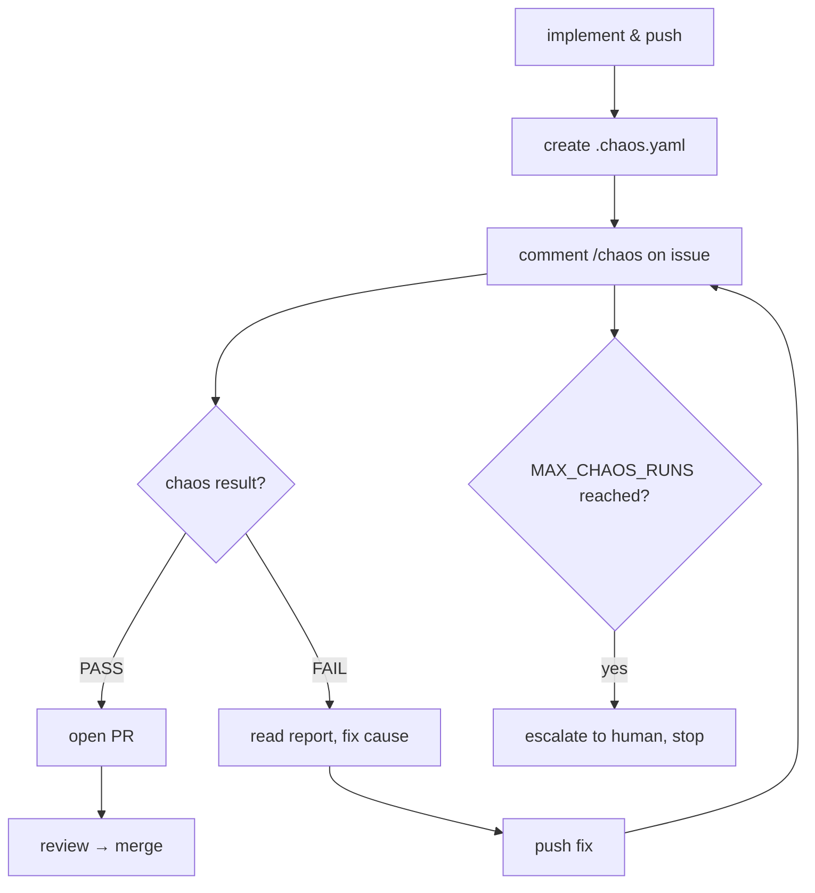

# Chaos Gate

Every issue must pass a deliberate-fault suite before its work can go up for review.

## Why Chaos Exists

Agents in this harness fail in three specific ways:

1. **They don't foresee error paths**: code that aborts on a transient 500 or exits when its dependency isn't reachable instead of retrying.
2. **They write non-idempotent code**: `CREATE TABLE` without `IF NOT EXISTS`, `INSERT` without `ON CONFLICT`, anything that appends instead of reconciling.
3. **They can't recover from invariant states**: half-applied, stuck, partially-failed deployments that need cleanup before the next attempt works.

A happy-path `deploy → wait-ready → curl` loop is blind to all three, because it never produces the states that expose them.

**Deterministic, not a chaos monkey.** Every fault is a fixed, named step — "reject the 3rd write with 409", "scale the dependency to zero" — never a random one. A random killer produces a failure the agent cannot reproduce, which for a small model is the worst possible feedback: it can't tell whether its fix worked or the dice simply landed differently.

## The Chaos-Passes-Then-PR Loop



The trigger is **agent-initiated, operator-executed** — the same split as teardown. The agent asks for a run by commenting on its own issue; it never holds the privilege to run the suite, so it cannot weaken or forge a verdict.

When the operator runs `just chaos-suite <name>`:
- Exit 0: all selected scenarios passed → `chaos-passed` label set on issue
- Exit 1: at least one scenario failed → `chaos-failed` label set (the agent's code is wrong)
- Exit 2: harness could not run (missing `.chaos.yaml`, no kubeconfig) → no verdict label set (harness problem, not code)

## The `.chaos.yaml` Contract

Each agent repo declares how its work is deployed, readied, and verified:

```yaml
namespace: default
deploy:  "kubectl apply -k ./deploy"          # must be safe to run twice
ready:   "kubectl rollout status deploy/<name> --timeout=120s"
verify:  "curl -fsS http://<name>.$VCLUSTER_NAME.localhost/healthz"
selector: "app=<name>"                         # the app's pods
dependency:                                     # optional
  name: postgres
  selector: "app=postgres"
  port: 5432
```

`$VCLUSTER_NAME` and `KUBECONFIG` are set for the commands; cwd is the workspace root. A missing or incomplete `.chaos.yaml` fails the suite with exit 2 and an actionable message.

## Triggering the Suite

The agent comments `/chaos` on the issue via curl:

```bash
source /workspace/.forgejo
curl -s -X POST "http://forgejo:3000/api/v1/repos/<user>/<repo>/issues/<n>/comments" \
  -u "$FORGEJO_USER:$FORGEJO_PASSWORD" -H "Content-Type: application/json" \
  -d '{"body":"/chaos"}'
```

The reconciler polls comments, the `chaos_gate` listener picks up the `/chaos` command, the operator runs `just chaos-suite`, and the report is posted back as an admin comment — never attributable to (or forgeable by) the agent being judged.

## Default Scenarios (suite: default)

These 6 scenarios are what the gate enforces:

| Scenario | Teaches | Catches |
|---|---|---|
| `reapply-twice` | Idempotency | Schema created without `IF NOT EXISTS`, seeds without `ON CONFLICT`, anything that appends instead of reconciling |
| `restart-cold` | Invariant recovery | A startup path that only works against an empty dependency |
| `kill-mid-apply` | Idempotency | Recovery that needs a human to clean up the half-built state first |
| `write-conflict` | Idempotency | Clobbering a concurrent change instead of re-reading on 409 |
| `api-flaky` | Foreseeing errors | A deploy that aborts on a transient 500/429 |
| `dependency-down` | Foreseeing errors | A process that exits at startup; a `/healthz` that returns 200 without touching the DB |

## Extended Scenarios (suite: extended)

Opt-in via `just chaos <agent> <scenario>`:

| Scenario | Teaches | Catches |
|---|---|---|
| `oom-squeeze` | Invariant recovery | State held only in memory; a crash loop that is terminal |
| `stuck-not-ready` | Invariant recovery | "The pod is Running" mistaken for "the pod is serving" |
| `partition` | Invariant recovery | Connections that hang forever with no timeout |
| `dependency-slow` | Foreseeing errors | Missing timeouts and probe budgets |

## Three Enforcement Layers

| # | Layer | Where | Status |
|---|---|---|---|
| 1 | The initial prompt orders `/chaos` before the PR step | `issue_claimer::send_initial_prompt` | Active |
| 2 | A PR without `chaos-passed` gets a blocking `REQUEST_CHANGES`; the approved-merge nudge is withheld; the stalled-agent nudge asks for `/chaos` instead of a PR | `chaos_enforcer`, `pr_monitor`, `health_monitor` | Active |
| 3 | Forgejo branch protection on `main` with *block merge on rejected reviews* | Forgejo repo settings | Not yet configured |

Layer 3 matters: the agent merges with its own credentials via the API, so a server-side rule is the only thing it genuinely cannot route around.

## Step Vocabulary

A scenario is an ordered list of steps; the runner stops at the first unmet expectation and reports which one.

| Step | Meaning |
|---|---|
| `deploy` | Run the `.chaos.yaml` deploy command |
| `ready` | Run the `.chaos.yaml` ready command |
| `verify` | Run the `.chaos.yaml` verify command |
| `arm` | Arm the fault webhook — `mode` (conflict 409 / error 500 / throttle 429), `ordinals`, `operations`, `resources` |
| `disarm` | Clear the armed fault |
| `assert-fired` | The armed fault actually fired ≥ `min` times |
| `kill` | Delete the pods matching a `target` (`app` or `dependency`) |
| `scale` | Scale a target to `replicas` |
| `stall` / `unstall` | Swap the container image for a pause image — present, scheduled, never Ready, out of endpoints |
| `squeeze` / `unsqueeze` | Drop the memory limit to force a real kernel OOMKill |
| `partition` | NetworkPolicy cutting egress to the dependency for `seconds` |
| `toxic` / `untoxic` | Toxiproxy fault (`latency`, `reset_peer`, `bandwidth`) — needs `dependency.proxy: true` |
| `sleep` | Wait |
| `assert-same` | Two captures must be identical |
| `assert-recovered` | Retry `ready` + `verify` until they pass or `timeout` expires |

Common fields: `expect: pass|fail` (default `pass`), `capture: <name>`, `note:` — the sentence the agent reads when that step is what failed.

## Runaway Guard

`MAX_CHAOS_RUNS = 5` per card (defined in `crates/pool-manager/src/state.rs`). On exhaustion the gate stops, ignores further `/chaos`, and posts:

> *"The suite has run 5 times on this issue without passing, which is the cap. The failures above are repeating, so the next attempt is unlikely to differ — this needs a change of approach, not another iteration."*

A weak model that cannot work out the fix must escalate, not spin.

## Fault Kit

The `charts/chaos/` Helm chart is installed inside the agent's vCluster. Everything is deployable by an ordinary namespace user: no privilege, no hostPath, no runtime socket.

| Component | What it is |
|---|---|
| `fault-webhook` | A `ValidatingAdmissionWebhook` rejecting a deterministic ordinal subset of writes (`conflict` 409, `error` 500, `throttle` 429). Runs on `oven/bun:1` with a handler mounted from a ConfigMap. |
| `toxiproxy` | `ghcr.io/shopify/toxiproxy:2.12.0` — the only zero-privilege way to inject latency (tc/netem would need `NET_ADMIN`). |
| RBAC | `chaos-runner` ServiceAccount + ClusterRole for API-only faults |

Cost: 2 pods, ~192Mi against the agent's 8Gi / 50-pod quota.

## Design Decisions

**`failurePolicy: Ignore`, not `Fail`.** A webhook that fails closed and crashes would reject every write in the agent's cluster — including the writes that would fix it. That is an unrecoverable state. The trade is that a dead webhook injects nothing silently, which is why every fault-injecting scenario ends with `assert-fired`.

**`assert-fired` is not ceremony.** It caught `kubectl apply` short-circuiting on unchanged objects: `apply` computes its patch client-side and sends no request at all when the object already matches the manifest, so an armed fault had nothing to reject. Scenarios now `scale` the live state away from the manifest first to guarantee a real write.

**The CA is generated once and reused via `lookup`.** Regenerating the cert on upgrade would rotate the Secret without rolling the pod, leaving the API server trusting a CA the process is not serving — `x509: certificate signed by unknown authority`, swallowed silently by `failurePolicy: Ignore`. The Secret carries `ca.crt` for reuse, and the Deployment carries a `checksum/tls` annotation for genuine rollouts.

**No `PATCH` in webhook rules.** The admission layer only knows `CREATE` / `UPDATE` / `DELETE` / `CONNECT`; listing `PATCH` is rejected by the API server at install time.

**`replicas: 1` on the fault webhook is load-bearing.** The ordinal counter lives in process memory; a second replica would split the count and "the 3rd write" would stop meaning anything.
