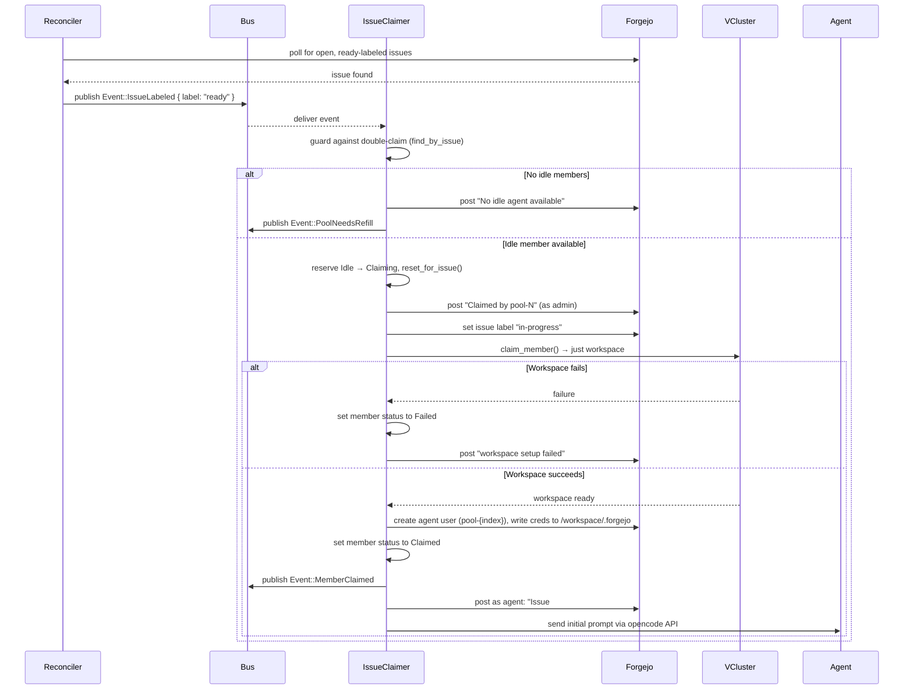

# Issue Claiming

How a `ready`-labeled Forgejo issue gets claimed by an agent.

## Flow

## Reconciler Polling

The reconciler polls Forgejo every `pollInterval` seconds (default 10s) for open issues with the `ready` label. When found, it publishes `Event::IssueLabeled { label: "ready" }` on the internal event bus.

## Double-Claim Guard

Before reserving a member, the `issue_claimer` checks `find_by_issue` on the shared state. This queries all members with status `Claiming` or `Claimed` to ensure no member already holds this issue.

## Member Reservation

An Idle member is reserved by:

1. Setting status to `Claiming`
2. Calling `reset_for_issue(issue_number)`, which clears:
   - All nudge flags (`nudge_create_pr`, `nudge_changes_requested`, `nudge_merge`)
   - Chaos status and run counter (`chaos_status`, `chaos_runs`)
   - Poll watermarks (`last_comment_seen`, `seen_pr`, `last_review_seen`, `pr_head_sha`)
   - Health tick (`last_health_tick`)

## Workspace Setup

`claim_member()` shells out to `just workspace`, which:

1. Clones the repository from Forgejo
2. Creates an ephemeral Forgejo user (`pool-{index}`) with write access to the repo
3. Writes agent credentials to `/workspace/.forgejo` (sourced by the agent's prompts)
4. Builds and launches the DevContainer

If workspace setup fails, the member is set to `Failed` and the pool refiller creates a replacement on the next tick.

## Initial Prompt

After claiming, the pool manager sends the agent its initial prompt via the opencode API. The prompt has 6 ordered steps:

1. **Source credentials**: `source /workspace/.forgejo`
2. **Create branch**: `git checkout -b issue-{n}`
3. **Implement**: write the fix or feature, commit with `Fixes #{n}: ...`, and push to `issue-{n}`
4. **Pass the chaos gate**: create `/workspace/.chaos.yaml` describing how the work is deployed, readied, and verified. Commit and push it, then trigger the suite by commenting `/chaos` on the issue via curl. If it fails, fix and retry. After 5 failed runs the gate stops and asks for a human.
5. **Create PR**: only after chaos passes, open a PR via curl to the Forgejo API
6. **Comment**: post the PR number on the issue

The prompt ends with: *"After completing all steps, report 'DONE: steps 1-6 completed, chaos passed, PR #`num` created.'"*
