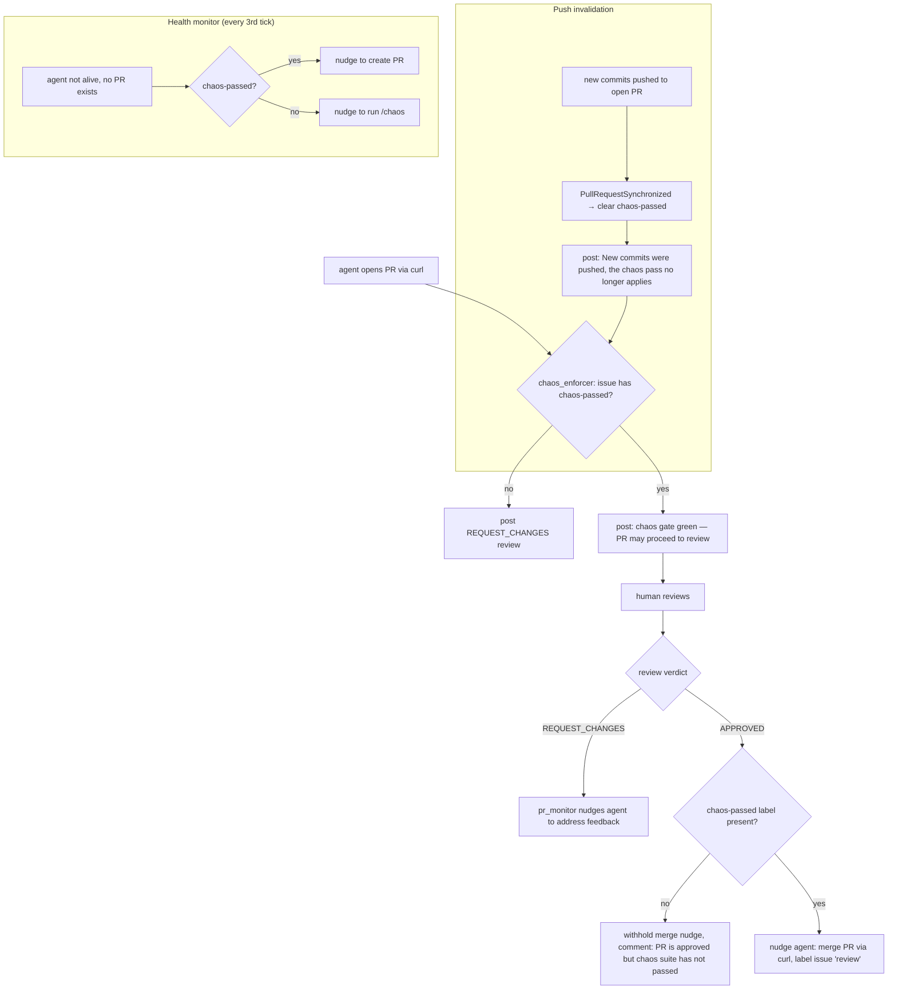

# PR Review & Merge

How pull requests are opened, reviewed, and merged — with chaos gate enforcement at every step.

## Flow



## PR Opening

When the chaos suite passes, the agent opens a PR via curl:

```bash
curl -s -X POST "http://forgejo:3000/api/v1/repos/<user>/<repo>/pulls" \
  -u "$FORGEJO_USER:$FORGEJO_PASSWORD" -H "Content-Type: application/json" \
  -d '{"title":"[#N] ...","head":"issue-N","base":"main","body":"Closes #N"}'
```

## Chaos Enforcer

The `chaos_enforcer` listener watches for `PullRequestOpened` and `PullRequestSynchronized` events from the reconciler's poll loop.

**On PR open** — checks if the issue carries the `chaos-passed` label:

- **If no**: posts a blocking `REQUEST_CHANGES` review with the body:

  > *"## Chaos gate: not passed. This PR cannot go to review yet — issue #N does not carry chaos-passed. Comment /chaos on issue #N."*

  The agent receives a prompt: *"Your PR was opened before the chaos suite passed, so it is blocked. Comment /chaos to run the suite."*

- **If yes**: logs `"chaos gate green — PR may proceed to review"` and allows the PR through. No blocking review is posted.

**On push invalidation** (`PullRequestSynchronized`) — if `chaos-passed` is set, clears it and posts:

> *"New commits were pushed, so the chaos pass no longer applies to this tree. Comment /chaos to re-run the suite before this can go to review."*

The member's `chaos_status` is reset to `NotRun`, and the entire PR returns to the blocked state. This prevents an agent from passing the suite on a stub and then pushing the real implementation.

## PR Monitor

The `pr_monitor` listener watches for `PullRequestReview` events from the reconciler's poll loop. It only acts on `APPROVED` and `REQUEST_CHANGES` review states.

**On REQUEST_CHANGES** — nudges the agent once (guarded by `nudge_changes_requested` flag):

> *"Your PR #N has changes requested. Read the review comments, make the requested changes, commit and push to branch issue-N. Then comment on issue #N that you've addressed the feedback."*

**On APPROVED** — first checks for `chaos-passed` as a second line of defence:

- **If `chaos-passed` is absent**: withholds the merge nudge and posts a comment:

  > *"This PR is approved but the chaos suite has not passed for the current commits. Comment /chaos to run it; the merge instruction follows a pass."*

- **If `chaos-passed` is present**: nudges the agent once (guarded by `nudge_merge` flag):

  > *"Your PR #N is approved. Merge it: curl .../pulls/N/merge ... Then label issue #N 'review' and comment that the PR is merged."*

## Health Monitor

The `health_monitor` listener runs on every 3rd `ReconciliationTick`. For each claimed member, it checks whether the agent's opencode API is alive.

If the agent is not responding and no PR exists for the issue:

- **If `chaos-passed` is set**: nudges the agent to create a PR (one-shot via `nudge_create_pr` flag)
- **If `chaos-passed` is not set**: nudges the agent to run `/chaos` instead — never nudges towards a PR before the gate is green, since `chaos_enforcer` would block it immediately

## Branch Protection (Layer 3)

The third enforcement layer is Forgejo branch protection on `main` with *block merge on rejected reviews*. This is **not yet configured** — it is the only layer the agent genuinely cannot route around, since the agent merges with its own credentials via the API.

Until layer 3 is active, layers 1 (prompt) and 2 (software enforcement in `chaos_enforcer`, `pr_monitor`, `health_monitor`) provide the operational gate. A determined agent could theoretically merge past a blocking review, but the combination of prompt ordering and software blocks makes accidental bypass impossible.
