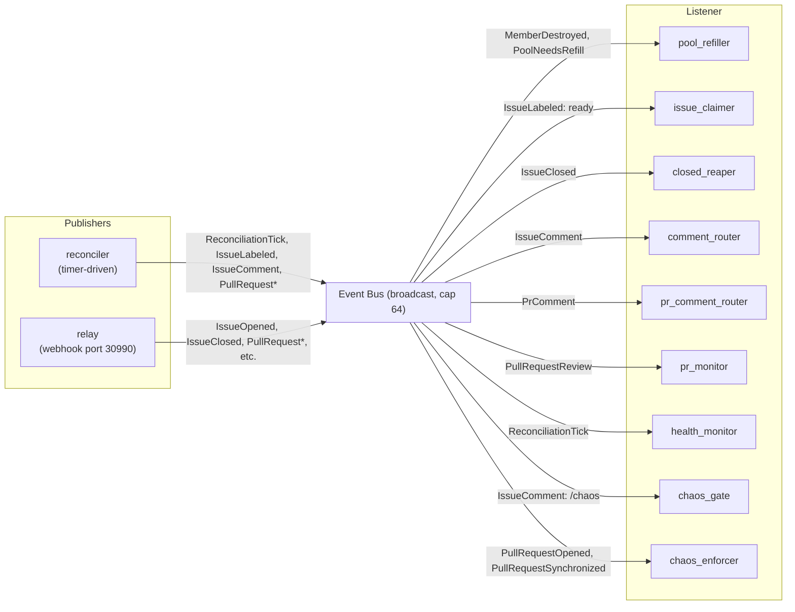

# Pool Manager

The `pool-manager` crate is a Rust binary that manages a warm pool of vCluster-backed
agent instances. It watches Forgejo for issues labeled `ready`, claims them on behalf of
idle agents, and enforces the chaos gate before any work reaches review.

## Binary & CLI

Built via `cargo run --release` (exposed as `just pool` in the justfile). The single
CLI flag is `--config`, defaulting to `scripts/pool-config.json`:

```
pool-manager --config scripts/pool-config.json
```

## Configuration

`pool-config.json` drives every behaviour:

| Key | Example | Purpose |
|-----|---------|---------|
| `minAvailable` | `3` | Minimum idle vClusters kept warm |
| `poolBase` | `20` | First index for pool member naming |
| `repo` | `adminadmin/board-integration-test` | Tracked Forgejo repo |
| `pollInterval` | `10` | Reconciler tick interval in seconds |
| `stateDir` | `~/.local/share/agent-pool` | Persistence directory |
| `webhookPort` | `30990` | Optional webhook relay listen port |
| `otlpEndpoint` | `http://localhost:30418` | Optional OTLP trace export |

## Modules

| Module | File | Role |
|--------|------|------|
| `agent` | `agent.rs` | OpenCode serve API client — session creation, prompt delivery, health checks |
| `config` | `config.rs` | Loads and deserialises `pool-config.json` |
| `event` | `event.rs` | Type-safe event enum, `Bus` wrapper around `broadcast::channel` |
| `forgejo` | `forgejo.rs` | Forgejo REST API client — labels, issues, PRs, reviews, comments, user management |
| `relay` | `relay.rs` | Axum webhook receiver on port 30990 |
| `state` | `state.rs` | `PoolState` with JSON persistence, member lifecycle, chaos verdicts, poll watermarks |
| `vcluster` | `vcluster.rs` | Shells out to `just provision` / `just workspace` / `just deprovision` |
| `listeners/` | directory | Ten event-driven listeners spawned by `spawn_all` + the reconciler |

## Event Bus

A `tokio::sync::broadcast` channel with capacity 64, wrapped in the `Bus` struct. Every
listener receives a clone of the sender and calls `bus.subscribe()` to obtain its own
receiver. Events are `Clone`, so every subscriber sees every event — the bus is fan-out,
not work-queue.

```rust
// event.rs
pub struct Bus {
    tx: broadcast::Sender<Event>,
}

impl Bus {
    pub fn new(capacity: usize) -> Self { ... }
    pub fn subscribe(&self) -> broadcast::Receiver<Event> { ... }
    pub fn publish(&self, event: Event) { ... }
}
```

## State Persistence

`PoolState` is serialised as JSON to `~/.local/share/agent-pool/state.json`. It is
loaded at boot via `PoolState::load_or_new()` and saved on every mutation: after
provisioning, claiming, chaos verdict recording, and at shutdown on `SIGINT`.

Key fields per member include status, assigned issue, nudge flags (`nudge_create_pr`,
`nudge_changes_requested`, `nudge_merge`), poll watermarks (`last_comment_seen`,
`seen_pr`, `last_review_seen`, `pr_head_sha`), and chaos gate state (`chaos_status`,
`chaos_runs`).

## Label Bootstrapping

On startup, `ensure_labels()` creates five labels on the configured Forgejo repo
(creating missing ones, leaving existing ones alone):

- `ready` — issue is ready to be claimed by an agent
- `in-progress` — agent is working on this
- `review` — agent is done, awaiting human review
- `chaos-passed` — the chaos suite passed for the current commits
- `chaos-failed` — the chaos suite failed; see the report comment

## Tracing

Log output is plain text by default. Setting the environment variable `POOL_LOG_JSON`
switches to JSON-formatted stdout (with `ansi = false`). If `otlpEndpoint` is configured,
an OTLP span exporter is attached with `service.name = "pool-manager"`.

## Graceful Shutdown

On `SIGINT` (`ctrl_c`):

1. Saves current `PoolState` to disk under the write lock
2. Publishes `Event::Shutdown` — every listener loop breaks on this
3. Waits 200ms for in-flight work to drain
4. Aborts the relay handle, the reconciler handle, and all listener handles

## Listeners

Ten listeners are spawned by `spawn_all()` in `listeners/mod.rs`:

| Listener | Subscribed Events | Purpose |
|----------|-------------------|---------|
| `pool_refiller` | `MemberDestroyed`, `PoolNeedsRefill` | Provisions new members when pool drops below `minAvailable` |
| `issue_claimer` | `IssueLabeled` (ready) | Claims idle members for ready-labeled issues |
| `closed_reaper` | `IssueClosed` | Destroys members when their issues are closed |
| `comment_router` | `IssueComment` | Routes issue comments to agents (e.g. human asks for a change) |
| `pr_comment_router` | `PrComment` | Routes PR review comments to agents |
| `pr_monitor` | `PullRequestReview` | Handles review events (changes requested, approved) |
| `health_monitor` | `ReconciliationTick` (every 3rd) | Checks agent liveness, chaos-aware nudges |
| `chaos_gate` | `IssueComment` (`/chaos`) | Executes the chaos suite on demand |
| `chaos_enforcer` | `PullRequestOpened`, `PullRequestSynchronized` | Blocks PRs without `chaos-passed` |
| `reconciler` | (publisher only — runs on its own timer) | Polls Forgejo, fires `ReconciliationTick` |

The reconciler is spawned separately via `spawn_reconciler()` because it does not
subscribe to the bus — it publishes into it.


