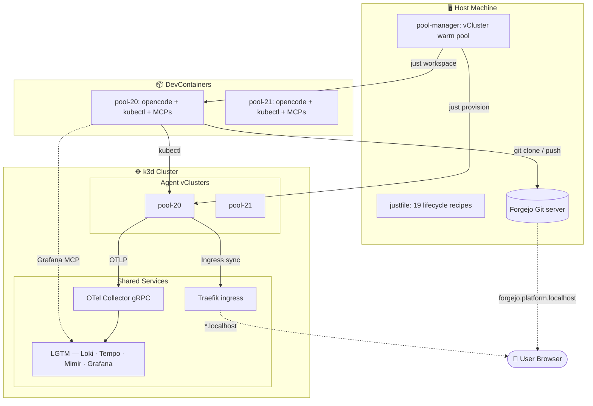

# Agentic Kubernetes Platform

A development harness where AI coding agents independently implement GitHub-style issues inside
isolated vClusters, with a mandatory chaos-testing gate before any work goes to review.

## What it does

- **Provisions** isolated vClusters per agent (own API server, CRDs, RBAC, CoreDNS)
- **Assigns** Forgejo issues to agents via a pool manager
- **Tests** every implementation under deliberate, reproducible faults before review
- **Observes** everything through a shared LGTM stack (Loki + Tempo + Mimir + Grafana)
- **Tears down** instantly with one command — zero drift

## Quick start

```bash
just bootstrap          # Create the host k3d cluster
just harden             # Cap Docker resources
just forgejo            # Start the local Git server
just observability      # Deploy LGTM observability
just pool               # Start the pool manager (auto-claims issues)
```

Or with Cilium (experimental):

```bash
just bootstrap-cilium   # k3d + Cilium CNI + Hubble
```

## Architecture at a glance



## Key design decisions

| Principle | Implementation |
|---|---|
| **Zero blast radius** | Agents have their own vCluster. `kubectl delete all` only affects their namespace. |
| **Real Kubernetes** | vClusters have real API servers, CRDs, RBAC, CoreDNS. Not a mock. |
| **Agent-triggered, operator-executed** | Agents ask for chaos runs by commenting `/chaos`; the operator executes and posts the verdict. |
| **Local-first** | Everything runs on one machine. No cloud, no external Git, no external API keys except the LLM provider. |
| **Justfile as interface** | Users never touch `kubectl` or `helm`. `just provision`, `just deprovision`, `just nuke`. |

## Where to go next

- [**Architecture Overview**](01-architecture/overview.md) — layers, data flows, Mermaid diagrams
- [**Agent Lifecycle**](02-lifecycle/agent-lifecycle.md) — from provision to teardown
- [**Chaos Gate**](02-lifecycle/chaos-gate.md) — how fault injection works and why
- [**Feature List**](06-reference/feature-list.md) — every built and planned feature
- [**Dependencies**](06-reference/dependencies.md) — every external dependency and what it does
